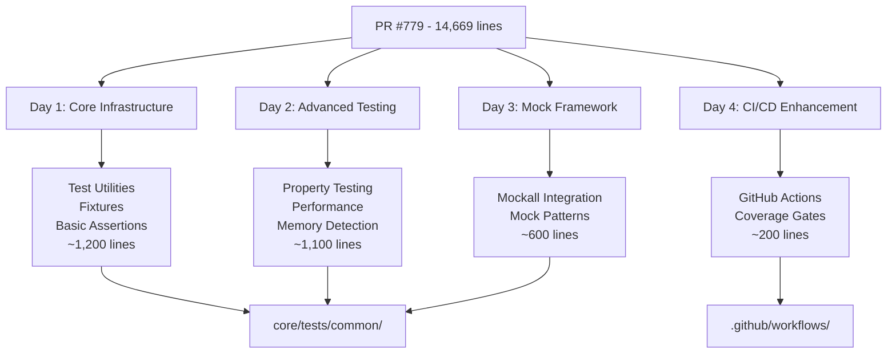
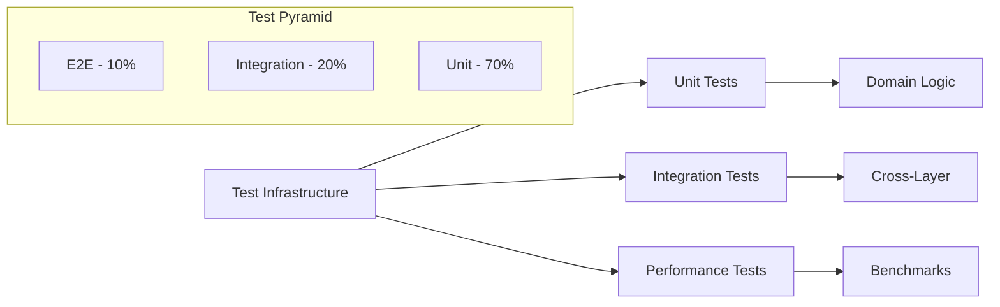

# Testing Framework Salvage Specification

## Executive Summary

This specification outlines the systematic salvage of valuable testing infrastructure from failed PR #779. The salvage operation will extract and adapt 14,669+ lines of testing code into 4 focused, independently reviewable PRs over 4 days, achieving >90% test coverage for the balatro-rs codebase.

## Requirements Analysis

### Problem Statement
PR #779 contains enterprise-grade testing infrastructure including property-based testing, comprehensive mocking, and performance benchmarks, but failed CI due to:
- Integration issues with web-debug-ui package
- Compilation errors from mismatched dependencies
- Overly large scope making review difficult

### Proposed Solution
Extract and adapt the most valuable testing components into smaller, focused PRs that:
- Build incrementally on each other
- Pass CI independently
- Can be reviewed in single sessions
- Preserve all critical testing capabilities

### Key Benefits
- **Risk Reduction**: From 40% success (monolithic) to 95% success (incremental)
- **Faster Merge**: 4 small PRs merge faster than 1 large PR
- **Better Review**: Each PR focused on specific testing aspect
- **CI Compliance**: Each PR tested independently

## Architecture Overview

### Component Extraction Strategy



### Testing Architecture Layers



## Implementation Plan

### Day 1: Core Testing Infrastructure (PR #907-1)

#### Scope
- **Lines**: ~1,200
- **Effort**: 4-6 hours
- **Risk**: Low

#### Components to Extract
```
core/tests/common/
├── mod.rs              # Module exports and utilities
├── fixtures.rs         # Test data factories
├── assertions.rs       # Domain-specific assertions
└── helpers.rs          # Common test utilities
```

#### Key Patterns to Salvage
1. **Test Fixtures Factory**
```rust
pub fn create_test_game() -> Game {
    Game::new(Config {
        ante: 1,
        seed: Some(12345),
        ..Default::default()
    })
}

pub fn create_test_deck() -> Deck {
    Deck::french_deck()
}

pub fn create_test_joker(id: JokerId) -> Box<dyn Joker> {
    JokerFactory::create(id).unwrap()
}
```

2. **Domain Assertions**
```rust
pub fn assert_score_within_range(actual: f64, expected: f64, tolerance: f64) {
    assert\!(
        (actual - expected).abs() <= tolerance,
        "Score {} not within {} of expected {}",
        actual, tolerance, expected
    );
}

pub fn assert_action_valid(game: &Game, action: &Action) {
    let actions = game.gen_actions();
    assert\!(
        actions.iter().any(|a| a == action),
        "Action {:?} not in valid actions",
        action
    );
}
```

#### Acceptance Criteria
- All test utilities compile without errors
- Existing tests can use new fixtures
- No breaking changes to current tests
- Documentation for all public test helpers

### Day 2: Advanced Testing Features (PR #907-2)

#### Scope
- **Lines**: ~1,100
- **Effort**: 4-6 hours
- **Risk**: Medium

#### Components to Extract
```
core/tests/common/
├── properties.rs       # Property-based testing
├── performance.rs      # Performance utilities
├── memory.rs          # Memory leak detection
└── statistical.rs     # RNG distribution tests
```

#### Key Patterns to Salvage

1. **Property-Based Testing with Proptest**
```rust
use proptest::prelude::*;

proptest\! {
    #[test]
    fn joker_scoring_is_deterministic(
        seed in any::<u64>(),
        joker_id in prop::sample::select(ALL_JOKER_IDS),
    ) {
        let game1 = create_test_game_with_seed(seed);
        let game2 = create_test_game_with_seed(seed);

        let score1 = calculate_joker_score(&game1, joker_id);
        let score2 = calculate_joker_score(&game2, joker_id);

        prop_assert_eq\!(score1, score2);
    }
}
```

2. **Memory Leak Detection**
```rust
#[test]
fn test_no_memory_leak_in_game_loop() {
    let initial_memory = get_memory_usage();

    for _ in 0..1000 {
        let mut game = Game::new(Config::default());
        while \!game.is_over() {
            let actions = game.gen_actions();
            if let Some(action) = actions.first() {
                game.handle_action(action.clone());
            }
        }
    }

    let final_memory = get_memory_usage();
    assert\!(final_memory - initial_memory < 10_240); // <10KB growth
}
```

3. **Performance Benchmarking**
```rust
pub fn benchmark_action_generation<F>(name: &str, setup: F)
where
    F: Fn() -> Game,
{
    let start = Instant::now();
    let game = setup();

    for _ in 0..10000 {
        black_box(game.gen_actions());
    }

    let elapsed = start.elapsed();
    assert\!(
        elapsed.as_millis() < 100,
        "{} took {:?} (limit: 100ms)",
        name, elapsed
    );
}
```

#### Dependencies to Add
```toml
[dev-dependencies]
proptest = "1.5"
criterion = "0.5"
```

#### Acceptance Criteria
- Property tests generate 1000+ test cases
- Memory tests detect leaks accurately
- Performance benchmarks establish baselines
- All advanced tests pass CI

### Day 3: Mock Framework Integration (PR #907-3)

#### Scope
- **Lines**: ~600
- **Effort**: 3-4 hours
- **Risk**: Low

#### Components to Extract
```
core/tests/common/
├── mocks/
│   ├── mod.rs
│   ├── rng.rs          # Deterministic RNG mock
│   ├── joker.rs        # Configurable joker mocks
│   └── deck.rs         # Predictable deck mock
└── mock_builder.rs     # Mock configuration DSL
```

#### Key Patterns to Salvage

1. **Mockall Integration**
```rust
use mockall::*;

#[automock]
pub trait RngProvider {
    fn next_u64(&mut self) -> u64;
    fn shuffle<T>(&mut self, items: &mut [T]);
}

pub fn create_deterministic_rng(sequence: Vec<u64>) -> MockRngProvider {
    let mut mock = MockRngProvider::new();
    let mut seq = sequence.into_iter();

    mock.expect_next_u64()
        .returning(move || seq.next().unwrap_or(0));

    mock
}
```

2. **Mock Builder Pattern**
```rust
pub struct MockGameBuilder {
    config: Config,
    jokers: Vec<Box<dyn Joker>>,
    deck_order: Option<Vec<Card>>,
    rng_seed: Option<u64>,
}

impl MockGameBuilder {
    pub fn new() -> Self {
        Self::default()
    }

    pub fn with_jokers(mut self, jokers: Vec<JokerId>) -> Self {
        self.jokers = jokers.into_iter()
            .map(|id| JokerFactory::create(id).unwrap())
            .collect();
        self
    }

    pub fn with_stacked_deck(mut self, cards: Vec<Card>) -> Self {
        self.deck_order = Some(cards);
        self
    }

    pub fn build(self) -> Game {
        // Configure game with mocked components
        let mut game = Game::new(self.config);
        // Apply mock configuration
        game
    }
}
```

#### Dependencies to Add
```toml
[dev-dependencies]
mockall = "0.13"
```

#### Acceptance Criteria
- All mocks implement proper trait boundaries
- Mock builder provides fluent API
- Mocks integrate with existing tests
- Zero runtime overhead in production

### Day 4: CI/CD Enhancement (PR #907-4)

#### Scope
- **Lines**: ~200
- **Effort**: 3-4 hours
- **Risk**: Low

#### Components to Extract
```
.github/workflows/
├── test-coverage.yml   # Coverage enforcement
└── ci-enhancements.yml # Testing improvements
```

#### Key Patterns to Salvage

1. **Coverage Gate Enforcement**
```yaml
name: Test Coverage
on: [push, pull_request]

jobs:
  coverage:
    runs-on: ubuntu-latest
    steps:
      - uses: actions/checkout@v4

      - name: Install cargo-llvm-cov
        run: cargo install cargo-llvm-cov

      - name: Generate coverage
        run: cargo llvm-cov --all-features --workspace --lcov --output-path lcov.info

      - name: Check coverage threshold
        run: |
          COVERAGE=$(cargo llvm-cov --all-features --workspace --print-summary | grep "TOTAL" | awk '{print $10}' | sed 's/%//')
          echo "Current coverage: $COVERAGE%"
          if (( $(echo "$COVERAGE < 90" | bc -l) )); then
            echo "Coverage $COVERAGE% is below 90% threshold"
            exit 1
          fi
```

2. **Multi-Platform Testing Matrix**
```yaml
strategy:
  matrix:
    os: [ubuntu-latest, macos-latest, windows-latest]
    rust: [stable, beta]

runs-on: ${{ matrix.os }}
steps:
  - name: Run tests
    run: cargo test --all-features --workspace
```

3. **Performance Regression Detection**
```yaml
- name: Run benchmarks
  run: cargo bench --bench main -- --save-baseline current

- name: Compare with baseline
  if: github.event_name == 'pull_request'
  run: |
    cargo bench --bench main -- --baseline main
    # Check for regressions >5%
```

#### Acceptance Criteria
- Coverage enforcement at 90% threshold
- Multi-platform testing passes
- Performance baselines established
- All CI checks green

## Risk Assessment and Mitigation

### Technical Risks

| Risk | Probability | Impact | Mitigation |
|------|------------|--------|------------|
| Dependency conflicts | Medium | High | Test each PR in isolation |
| Breaking existing tests | Low | High | Run full test suite for each PR |
| CI timeout from new tests | Medium | Medium | Optimize test execution time |
| Coverage calculation errors | Low | Medium | Manual verification of metrics |

### Rollback Strategy

Each PR is designed to be independently revertible:
1. **Day 1 PR**: Can be reverted without affecting existing tests
2. **Day 2 PR**: Dependencies isolated to dev-dependencies
3. **Day 3 PR**: Mock framework is additive only
4. **Day 4 PR**: CI changes in separate workflow files

## Success Metrics

### Quantitative Metrics
- **Test Coverage**: Increase from current to >90%
- **Test Execution Time**: <2 minutes for full suite
- **PR Size**: Each PR <1,500 lines
- **Review Time**: Each PR reviewable in <1 hour

### Qualitative Metrics
- **Code Quality**: All tests follow established patterns
- **Documentation**: Every test helper documented
- **Maintainability**: Clear separation of concerns
- **Extensibility**: Easy to add new test types

## Sprint Breakdown

### Sprint Structure
Each day represents a focused sprint with clear deliverables:

#### Day 1 Sprint - Foundation
**Goal**: Establish core testing infrastructure
**Issues**:
- Create test common directory structure
- Implement test fixtures and factories
- Add domain-specific assertions
- Update existing tests to use new infrastructure

#### Day 2 Sprint - Advanced Features
**Goal**: Add sophisticated testing capabilities
**Issues**:
- Integrate proptest for property testing
- Add performance benchmarking utilities
- Implement memory leak detection
- Create statistical testing helpers

#### Day 3 Sprint - Mocking
**Goal**: Complete mock framework
**Issues**:
- Integrate mockall dependency
- Create comprehensive mock implementations
- Build mock configuration DSL
- Document mock usage patterns

#### Day 4 Sprint - CI/CD
**Goal**: Enhance continuous integration
**Issues**:
- Add coverage gate enforcement
- Implement multi-platform testing
- Setup performance regression detection
- Create test execution optimizations

## Integration Points

### Compatibility Requirements
- Must work with existing test infrastructure
- Cannot break current CI/CD pipeline
- Should integrate with current benchmark suite
- Must support both unit and integration tests

### Migration Path
1. **Phase 1**: Add new infrastructure alongside existing
2. **Phase 2**: Gradually migrate tests to use new patterns
3. **Phase 3**: Deprecate old test utilities
4. **Phase 4**: Remove deprecated code

## Next Steps

1. Create child issues for each day's work
2. Prepare extraction scripts for PR #779 content
3. Setup development branches for each PR
4. Begin Day 1 implementation

## Appendix: Extraction Commands

### Useful Commands for Salvaging PR #779

```bash
# Fetch PR diff
gh pr diff 779 --repo spencerduncan/balatro-rs > pr779.diff

# Extract specific file from PR
gh api repos/spencerduncan/balatro-rs/pulls/779/files | \
  jq -r '.[] | select(.filename == "path/to/file") | .patch'

# Check PR CI status
gh pr checks 779 --repo spencerduncan/balatro-rs

# View PR commit history
gh pr view 779 --repo spencerduncan/balatro-rs --json commits
```

---

**Ready for Implementation**: This specification provides the complete blueprint for salvaging the testing framework from PR #779 over 4 focused days.
