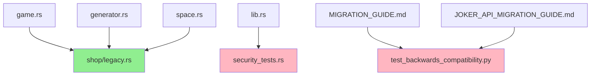

# Cleanup Obsolete Files and Improve .gitignore - Technical Specification

## Executive Summary
This specification addresses issue #318, which involves cleaning up obsolete files, reorganizing misplaced documentation and test files, and updating the .gitignore to prevent similar issues in the future. The cleanup will improve code organization, reduce repository size by ~860KB, and prevent confusion from obsolete or misplaced files.

## Requirements Analysis

### Functional Requirements
1. **File Removal**
   - Remove 4 identified obsolete files totaling ~892KB
   - Ensure no broken dependencies after removal
   - Update documentation references where needed

2. **File Reorganization**
   - Move 2 documentation files to appropriate location
   - Move 1 test file to tests directory
   - Update imports and module declarations

3. **Version Control Improvements**
   - Update .gitignore to exclude coverage reports
   - Update .gitignore to exclude backup files
   - Prevent future accumulation of generated artifacts

### Non-Functional Requirements
- **Maintainability**: Improve code organization and discoverability
- **Build Integrity**: Ensure all builds and tests pass after changes
- **Documentation**: Keep all documentation references accurate
- **Version Control**: Reduce repository size and prevent artifact commits

## Architecture Overview

### Current State Analysis
```
Repository Root/
├── coverage.lcov (858KB - generated artifact)
├── core/
│   ├── src/
│   │   ├── joker_impl.rs.backup (24KB - backup file)
│   │   ├── debug_test.rs (790B - unused test)
│   │   ├── security_tests.rs (test file in wrong location)
│   │   ├── JOKER_LIFECYCLE_LESSONS.md (docs in wrong location)
│   │   ├── BUYJOKER_REVIEW_LESSONS.md (docs in wrong location)
│   │   └── shop/
│   │       └── legacy.rs (actively used - DO NOT REMOVE)
│   └── tests/
└── pylatro/
    ├── test_backwards_compatibility.py (9KB - duplicate)
    └── test/
        └── test_backwards_compatibility.py (correct location)
```

### Target State
```
Repository Root/
├── JOKER_LIFECYCLE_LESSONS.md (moved from core/src/)
├── BUYJOKER_REVIEW_LESSONS.md (moved from core/src/)
├── core/
│   ├── src/
│   │   └── shop/
│   │       └── legacy.rs (kept - actively used)
│   └── tests/
│       └── security_tests.rs (moved from src/)
└── pylatro/
    └── test/
        └── test_backwards_compatibility.py (only copy)

Removed:
- coverage.lcov
- core/src/joker_impl.rs.backup
- core/src/debug_test.rs
- pylatro/test_backwards_compatibility.py
```

### File Dependency Analysis



## Implementation Plan

### Development Approach
- **Methodology**: Incremental changes with verification after each step
- **Testing Strategy**: Run full test suite after each major change
- **Rollback Strategy**: Git-based - each step is a separate commit

### Quality Assurance Strategy
1. **Pre-change Baseline**
   - Record current test results
   - Document current build time
   - Note current repository size

2. **Per-change Verification**
   - Run `cargo test --all` after each file operation
   - Run `cargo build` to verify compilation
   - Check for broken imports or references

3. **Post-change Validation**
   - Verify all tests still pass
   - Confirm build succeeds
   - Check documentation links work
   - Validate .gitignore effectiveness

## Risk Assessment and Mitigation

### Technical Risks
1. **Risk**: Breaking imports when moving security_tests.rs
   - **Probability**: Medium
   - **Impact**: Build failure
   - **Mitigation**: Update imports before moving, test compilation

2. **Risk**: Removing actively used legacy.rs
   - **Probability**: Low (clearly documented as needed)
   - **Impact**: Critical - would break game functionality
   - **Mitigation**: Analysis confirmed it's actively used - DO NOT REMOVE

3. **Risk**: Documentation references breaking
   - **Probability**: High (confirmed references exist)
   - **Impact**: Low - documentation confusion
   - **Mitigation**: Update all references in migration guides

### Rollback Strategy
Each change will be committed separately, allowing granular rollback:
1. File removals - single commit
2. Documentation moves - single commit  
3. Test file move - single commit
4. .gitignore update - single commit

## Sprint Breakdown

### Sprint 1: File Cleanup and Removal (1 day)
**Goal**: Remove obsolete files and update documentation references

**Issues**:
1. **Remove obsolete backup and generated files**
   - Remove `core/src/joker_impl.rs.backup`
   - Remove `coverage.lcov`
   - Remove `core/src/debug_test.rs`
   - Verify build and tests pass
   - Acceptance: Files removed, no build errors

2. **Remove duplicate test file and update references**
   - Remove `pylatro/test_backwards_compatibility.py`
   - Update references in `pylatro/MIGRATION_GUIDE.md`
   - Update references in `pylatro/JOKER_API_MIGRATION_GUIDE.md`
   - Acceptance: Duplicate removed, documentation accurate

### Sprint 2: File Reorganization (1 day)
**Goal**: Move files to appropriate locations

**Issues**:
3. **Move documentation files to root**
   - Move `core/src/JOKER_LIFECYCLE_LESSONS.md` to root
   - Move `core/src/BUYJOKER_REVIEW_LESSONS.md` to root
   - Verify files are accessible
   - Acceptance: Documentation organized properly

4. **Move security tests to tests directory**
   - Update imports in `security_tests.rs` from `crate::` to `balatro_rs::`
   - Move `core/src/security_tests.rs` to `core/tests/`
   - Remove `pub mod security_tests;` from `core/src/lib.rs`
   - Run tests to verify they still work
   - Acceptance: Tests run from new location

### Sprint 3: Version Control Improvements (0.5 day)
**Goal**: Update .gitignore to prevent future issues

**Issues**:
5. **Update .gitignore for coverage files**
   - Add `*.lcov` pattern
   - Add `coverage/` directory pattern
   - Test by generating coverage report
   - Acceptance: Coverage files are ignored

6. **Update .gitignore for backup files**
   - Add `*.backup` pattern
   - Add `*.old` pattern
   - Add `*.orig` pattern
   - Create test backup file to verify
   - Acceptance: Backup files are ignored

## Success Metrics
- **Repository Size**: Reduction of ~892KB
- **Build Success**: All builds pass without errors
- **Test Success**: All tests pass from new locations
- **Documentation**: All references are accurate
- **Prevention**: New .gitignore rules prevent similar issues

## Validation Checklist
- [ ] All 4 obsolete files removed
- [ ] Documentation files moved to root
- [ ] Security tests moved to tests directory
- [ ] All imports and references updated
- [ ] .gitignore updated with new patterns
- [ ] Full test suite passes
- [ ] Documentation references are accurate
- [ ] No broken builds or imports