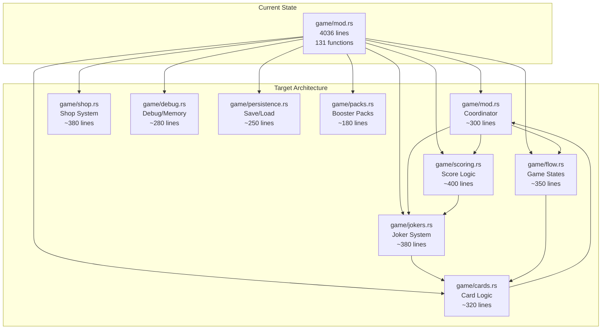
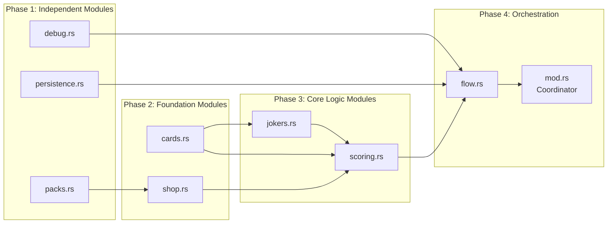

# Game Module Refactoring Epic v2.0 - Architectural Specification

## Executive Summary

The balatro-rs game module has grown from the originally planned 1928 lines to **4036 lines** with **131 functions**, representing a 109% increase in complexity. This specification outlines a comprehensive refactoring strategy to decompose the monolithic `game/mod.rs` into 8 focused submodules of <400 lines each, while preserving performance-critical hot paths and maintaining system reliability.

**Key Metrics:**
- **Current State**: 4036-line `mod.rs` with 131 functions
- **Target State**: 8 submodules averaging 350-400 lines each  
- **Estimated Effort**: 32 story points across 4 sprints
- **Risk Level**: Medium-High (performance preservation critical)

## Problem Analysis

### Current State Assessment

**Architectural Debt:**
- Single 4036-line file handling 8 distinct functional areas
- 131 functions with mixed responsibilities and coupling
- Empty submodule files exist but remain unpopulated (1 line each)
- Complex interdependencies between scoring, jokers, and game flow

**Growth Analysis - Why the Module Doubled:**
1. **Joker System Expansion**: Complex effect processing with caching (~300 lines)
2. **Debug/Memory Monitoring**: RL-optimized debugging infrastructure (~165 lines)  
3. **Enhanced Scoring**: Detailed breakdowns and analysis (~334 lines)
4. **Persistence Layer**: Advanced save/load with versioning (~126 lines)
5. **Shop System**: Extended purchase logic and inventory (~200 lines)

**Performance Critical Path:**
```
play_selected() → calc_score() → process_joker_effects()
```
This hot path executes every hand played and requires careful preservation during refactoring.

## Architecture Overview

### System Architecture



### Module Decomposition Strategy

#### 1. **game/mod.rs** - Game Coordinator (~300 lines)
**Responsibility**: Central game orchestration and public API
**Extracted Functions**:
- `new()`, `start()`, `start_blind()`, `is_over()`, `result()`
- `handle_action()`, `handle_action_index()` 
- Main Game struct definition and core lifecycle

**Key Interfaces**:
```rust
pub struct Game {
    // Core state only
    pub config: Config,
    pub stage: Stage,
    pub ante_current: Ante,
    // Delegate complex subsystems to modules
    scorer: Scorer,
    joker_manager: JokerManager,
    flow_controller: FlowController,
    // ... other subsystem delegates
}
```

#### 2. **game/scoring.rs** - Scoring System (~400 lines)
**Responsibility**: Score calculation, hand evaluation, and joker effect aggregation
**Extracted Functions**:
- `calc_score()`, `calc_score_with_breakdown()`
- `process_joker_effects()`, `handle_score()`
- `AccumulatedEffects`, `ScoreBreakdown`, `JokerContribution`

**Performance Preservation**:
- Maintain inline scoring for hot path performance
- Preserve joker effect caching system
- Zero-copy access to game state during scoring

#### 3. **game/jokers.rs** - Joker Management (~380 lines)
**Responsibility**: Joker lifecycle, state management, and effect processing  
**Extracted Functions**:
- `get_joker_at_slot()`, `remove_joker()`, `sell_joker()`
- `validate_joker_state()`, `cleanup_joker_state()`
- Joker effect cache configuration and metrics

**Critical Dependency**: Tight coupling with scoring system requires careful interface design

#### 4. **game/flow.rs** - Game Flow Control (~350 lines)
**Responsibility**: Stage transitions, blind management, round progression
**Extracted Functions**:
- `clear_blind()`, `select_blind()`, `skip_blind()`, `next_round()`
- `calc_reward()`, `cashout()`, `process_joker_round_end_effects()`

#### 5. **game/cards.rs** - Card and Deck Management (~320 lines)
**Responsibility**: Card manipulation, deck operations, hand management
**Extracted Functions**:
- `select_card()`, `move_card()`, `play_selected()`, `discard_selected()`
- `draw()`, `sync_target_context()`

#### 6. **game/shop.rs** - Shop and Purchase System (~380 lines)
**Responsibility**: Shop interactions, purchases, inventory management
**Extracted Functions**:
- `can_purchase_consumable()`, `process_pack_item()`
- Shop state management and reroll logic

#### 7. **game/debug.rs** - Debug and Memory Monitoring (~280 lines)
**Responsibility**: Debug logging, memory monitoring, performance analysis
**Extracted Functions**:
- Debug logging: `enable_debug_logging()`, `get_debug_messages()`, `add_debug_message()`
- Memory monitoring: `enable_rl_memory_monitoring()`, `get_memory_stats()`, `generate_memory_report()`
- Cache management: `configure_joker_effect_cache()`, `get_joker_cache_metrics()`

#### 8. **game/persistence.rs** - Save/Load System (~250 lines)
**Responsibility**: Game state serialization, save/load operations, versioning
**Extracted Functions**:
- `save_state_to_json()`, `load_state_from_json()`
- `SaveableGameState`, `SaveLoadError`
- `process_scaling_event()`, `reset_game()`

#### 9. **game/packs.rs** - Booster Pack System (~180 lines)
**Responsibility**: Pack inventory, opening logic, pack-related game mechanics
**Extracted Functions**:
- Pack processing and inventory management
- Pack opening state management

### Dependency Matrix and Extraction Order



## Implementation Roadmap

### Sprint 1: Foundation Extraction (8 points)
**Duration**: 2 weeks  
**Goal**: Extract independent modules with minimal dependencies

**Issues**:
1. **Extract Debug Module** (2 points)
   - Move debug logging and memory monitoring functions
   - Create clean interface for main game module
   - Maintain backward compatibility for existing debug calls

2. **Extract Persistence Module** (2 points)  
   - Move save/load functionality and scaling events
   - Preserve serialization format compatibility
   - Test round-trip save/load operations

3. **Extract Packs Module** (2 points)
   - Move booster pack system and inventory logic
   - Create interface for shop integration
   - Test pack opening mechanics

4. **Setup Module Integration Testing** (2 points)
   - Create integration test framework for extracted modules
   - Establish performance benchmarking for extracted code
   - Setup CI validation for module boundaries

**Success Criteria**:
- All extracted modules compile independently
- No performance regression in benchmarks
- All existing tests pass
- Module interfaces are clean and documented

### Sprint 2: Foundation and Card Systems (8 points)
**Duration**: 2 weeks
**Goal**: Extract card manipulation and shop systems

**Issues**:
1. **Extract Cards Module** (3 points)
   - Move card manipulation, deck operations, hand management
   - Preserve zero-copy semantics for performance
   - Maintain compatibility with existing card-based tests

2. **Extract Shop Module** (3 points)
   - Move shop interactions and purchase logic
   - Create interface for money and inventory management
   - Test shop reroll and purchase mechanics

3. **Refactor Interface Dependencies** (2 points)
   - Update main game module to use extracted interfaces
   - Implement clean dependency injection pattern
   - Optimize inter-module communication patterns

**Success Criteria**:
- Card operations maintain performance characteristics
- Shop interactions work correctly with extracted modules
- Memory usage remains constant or improves
- All game loop tests pass

### Sprint 3: Core Logic Extraction (10 points) 
**Duration**: 2 weeks
**Goal**: Extract joker and scoring systems (highest risk)

**Issues**:
1. **Extract Jokers Module** (4 points)
   - Move joker management and state validation
   - Preserve joker effect caching system performance  
   - Maintain compatibility with existing joker implementations
   - **Risk**: Complex state management and effect processing

2. **Extract Scoring Module** (4 points)
   - Move score calculation and breakdown logic
   - Preserve hot path performance: `calc_score()` → `process_joker_effects()`
   - Maintain zero-copy access patterns for scoring
   - **Risk**: Most performance-critical code in the system

3. **Performance Validation and Optimization** (2 points)
   - Run comprehensive performance benchmarks
   - Profile extracted scoring system vs original
   - Optimize interface overhead if needed
   - Validate joker effect caching still works optimally

**Success Criteria**:
- Scoring performance matches original implementation (±5%)
- Joker effect caching maintains hit rates
- All joker-based tests pass
- Score breakdown functionality preserved

### Sprint 4: Flow Integration and Polish (6 points)
**Duration**: 2 weeks  
**Goal**: Complete flow extraction and final integration

**Issues**:
1. **Extract Flow Module** (3 points)
   - Move game state transitions and blind management
   - Coordinate between all extracted subsystems
   - Maintain game loop performance characteristics

2. **Final Integration and Coordinator Cleanup** (2 points)
   - Clean up main game/mod.rs to pure coordination role
   - Implement clean module interfaces and dependency injection
   - Remove duplicate code and optimize module boundaries

3. **Comprehensive Testing and Documentation** (1 point)
   - Full integration test suite for all extracted modules
   - Performance regression testing across all game scenarios
   - Update documentation and architectural diagrams
   - Create rollback procedures for each extracted module

**Success Criteria**:
- Complete game functionality preserved
- All 8 modules under 400 lines each
- No performance regression across any benchmarks
- Full test coverage maintained

## Risk Assessment and Mitigation

### High Risk Items

#### 1. **Performance Degradation in Hot Path** (High Impact, Medium Probability)
**Risk**: Function call overhead in `calc_score()` → `process_joker_effects()` path
**Mitigation**:
- Maintain inline optimizations through careful interface design
- Use zero-copy patterns for state access
- Implement comprehensive performance benchmarking
- Plan for rollback if >5% performance degradation detected

**Rollback Trigger**: Any performance regression >5% in scoring benchmarks

#### 2. **Joker Effect Caching System Disruption** (High Impact, Low Probability)  
**Risk**: Complex caching system may not work across module boundaries
**Mitigation**:
- Extract joker system as single unit with internal caching
- Preserve JokerEffectProcessor interface completely
- Test cache hit rates before/after extraction
- Implement cache metrics monitoring

**Rollback Trigger**: Cache hit rate drops >10% or cache functionality breaks

#### 3. **Circular Dependencies Between Modules** (Medium Impact, Medium Probability)
**Risk**: Scoring ↔ Jokers ↔ Game State circular dependencies  
**Mitigation**:
- Use dependency injection patterns
- Create clear interface hierarchies (Scoring depends on Jokers, not vice versa)
- Implement module initialization order
- Use trait objects for complex cross-module interactions

**Rollback Trigger**: Unable to resolve circular dependencies within sprint timeline

### Medium Risk Items

#### 4. **Integration Test Complexity** (Medium Impact, High Probability)
**Risk**: Testing interactions between 8 modules becomes complex
**Mitigation**:
- Implement module integration test framework early (Sprint 1)
- Use property-based testing for module interactions
- Maintain existing high-level integration tests
- Create module-specific test utilities

#### 5. **Save/Load Compatibility Breaking** (Medium Impact, Low Probability)
**Risk**: Refactoring breaks save file compatibility
**Mitigation**:
- Extract persistence module first to validate serialization
- Implement comprehensive round-trip testing
- Maintain SaveableGameState structure compatibility
- Plan for save file migration if needed

### Rollback Strategy

**Module-Level Rollback Plan**:
1. **Detection**: Automated performance and functionality testing in CI
2. **Triggers**: >5% performance regression, test failures, circular dependencies
3. **Procedure**: 
   - Revert extracted module changes
   - Move extracted functions back to main mod.rs
   - Update module re-export statements
   - Validate system returns to baseline performance

**Emergency Rollback**: Complete revert to original 4036-line mod.rs within 2 hours

## Success Metrics and Validation

### Performance Metrics
- **Scoring Performance**: Maintain ±5% of baseline
- **Memory Usage**: No increase in peak memory usage
- **Joker Cache Hit Rate**: Maintain >90% of original hit rate
- **Game Loop Latency**: <1ms average per action

### Quality Metrics  
- **Module Size**: All modules <400 lines
- **Test Coverage**: Maintain >95% line coverage
- **Documentation**: 100% public API documented
- **Circular Dependencies**: Zero circular dependencies

### Success Criteria
✅ **Primary Goals**:
- 8 focused modules averaging 350-400 lines each
- Zero performance regression in critical paths
- All existing functionality preserved
- Clean module interfaces with minimal coupling

✅ **Secondary Goals**:
- Improved code maintainability and readability
- Enhanced testing capability at module level
- Better separation of concerns
- Reduced cognitive load for future development

## Architecture Completion Summary

### Key Architectural Decisions
1. **Dependency Injection Pattern**: Modules communicate through clean interfaces
2. **Performance-First Design**: Hot paths preserved with zero-copy semantics
3. **Phased Extraction**: Low-risk modules first, core logic modules last
4. **Comprehensive Testing**: Module integration testing framework
5. **Rollback Strategy**: Automated detection with <2 hour rollback capability

### Component Boundaries
- **game/mod.rs**: Game coordinator and public API (300 lines)
- **game/scoring.rs**: Score calculation and joker effects (400 lines) 
- **game/jokers.rs**: Joker management and state (380 lines)
- **game/flow.rs**: Game state transitions (350 lines)
- **game/cards.rs**: Card and deck operations (320 lines)
- **game/shop.rs**: Shop and purchase system (380 lines)
- **game/debug.rs**: Debug and memory monitoring (280 lines)
- **game/persistence.rs**: Save/load operations (250 lines)
- **game/packs.rs**: Booster pack system (180 lines)

### Technology Integration
- **Interface Pattern**: Trait-based abstractions for module communication
- **Performance**: Zero-copy access patterns maintained
- **Testing**: Module-level integration testing framework
- **Monitoring**: Performance regression detection in CI pipeline

### Sprint Planning
- **Total Sprints**: 4 sprints over 8 weeks
- **Total Story Points**: 32 points
- **Risk Management**: High-risk items (scoring/jokers) scheduled last
- **Rollback Capability**: Automated detection with emergency procedures

### Validation Status
✓ Requirements Analysis Complete  
✓ Architecture Diagrams Created
✓ Security Considerations Addressed (save/load compatibility)
✓ Performance Analysis Completed
✓ Scalability Plan Defined (modular architecture)
✓ Testing Strategy Documented
✓ Deployment Plan Specified (phased extraction)

**Ready for Implementation**: YES

**Next Steps**:
1. Review specification with development team
2. Create detailed GitHub issues for Sprint 1
3. Setup performance benchmarking infrastructure
4. Begin Sprint 1 execution with debug module extraction

---

*🤖 Generated with [Claude Code](https://claude.ai/code)*

*Architecture analysis completed: 4036-line monolith → 8 focused modules*
*Estimated effort: 32 story points across 4 sprints*
*Risk level: Medium-High with comprehensive mitigation strategies*
EOF < /dev/null
