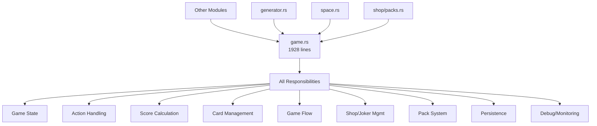
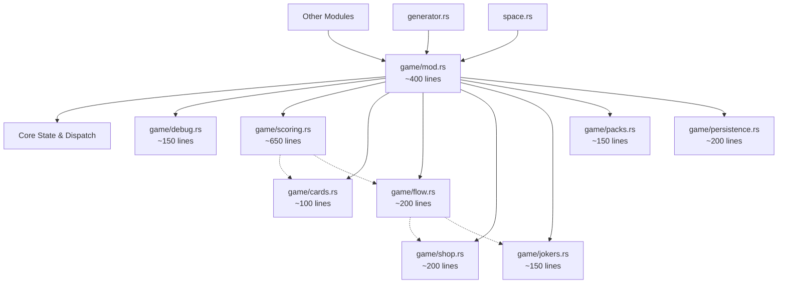
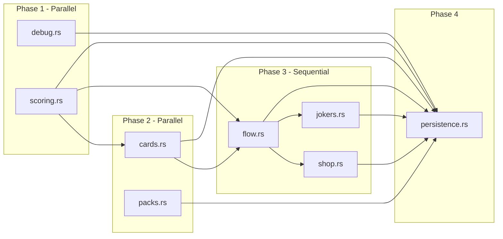

# Game.rs Refactoring Technical Specification

## Executive Summary

The `game.rs` module has grown to 1928 lines and become a "God Module" handling too many responsibilities. This specification outlines a systematic refactoring plan to break it into focused submodules while maintaining functionality and enabling parallel development.

### Problem Statement
- Single 1928-line module violating Single Responsibility Principle
- 22 imports indicating high coupling
- 28 public functions creating excessive API surface
- Difficult to test, maintain, and extend

### Proposed Solution
- Break into 8 focused submodules under `game/` directory
- Implement in 4 phases with parallel work opportunities
- Make small, atomic changes that can be independently merged
- Update tests incrementally with each change

### Key Benefits
- Improved maintainability and code organization
- Better testability with focused unit tests
- Enables parallel development across team
- Reduces cognitive load for developers

## Requirements Analysis

### Functional Requirements
1. **Maintain all existing game functionality** - No features should be lost
2. **Preserve performance characteristics** - CPU time is critical, memory less so
3. **Support existing public API** - Initially maintain compatibility, then deprecate
4. **Enable incremental migration** - Each PR should leave the codebase functional

### Non-Functional Requirements
1. **Performance**: Minimize CPU overhead from additional function calls
2. **Testability**: Each module should have focused unit tests
3. **Maintainability**: Clear separation of concerns and single responsibilities
4. **Parallelization**: Enable multiple developers to work simultaneously

### Technical Constraints
1. **Breaking changes allowed** - Can modify public API
2. **No save compatibility required** - Old saves can be abandoned
3. **Small atomic changes** - Each PR should be <200 lines changed
4. **Fast iteration** - Complete refactoring in 2-3 weeks

## Architecture Overview

### Current Architecture (Problematic)



### Target Architecture (Modular)



### Module Dependency Graph



## Implementation Plan

### Phase 0: Foundation (1 PR)

#### PR #1: Create game module structure
**Size**: ~50 lines
**Dependencies**: None
**Can be done by**: Anyone

```rust
// core/src/game/mod.rs
pub mod debug;
pub mod scoring;
pub mod cards;
pub mod flow;
pub mod shop;
pub mod jokers;
pub mod packs;
pub mod persistence;

// Re-export Game struct and essential types
pub use crate::Game;
```

- Create `core/src/game/` directory
- Add empty module files
- Update `core/src/lib.rs` to use `mod game;`
- Update all imports from `use crate::game::Game` to `use crate::game::Game`

### Phase 1: Independent Extractions (2 PRs - Parallel)

#### PR #2: Extract debug module
**Size**: ~150 lines moved + ~50 lines changes
**Dependencies**: PR #1
**Can be done by**: Developer A

1. Move debug-related fields from Game struct to DebugState struct
2. Move all debug/monitoring methods to `game/debug.rs`
3. Add `debug_state: DebugState` field to Game
4. Update method calls to use `self.debug_state.method()`
5. Update tests in game.rs that use debug methods

Methods to move:
- `enable_debug_logging()`
- `get_debug_messages()`
- `add_debug_message()`
- `enable_rl_memory_monitoring()`
- `enable_simulation_memory_monitoring()`
- `get_memory_stats()`
- `generate_memory_report()`
- `check_memory_safety()`

#### PR #3: Extract scoring module  
**Size**: ~650 lines moved + ~100 lines changes
**Dependencies**: PR #1
**Can be done by**: Developer B

1. Move `ScoreBreakdown` and `JokerContribution` structs to `game/scoring.rs`
2. Create `ScoreCalculator` struct with methods
3. Move scoring methods as associated functions
4. Update Game to call `ScoreCalculator::calc_score(game_context)`
5. Update all tests that use scoring

Methods to move:
- `calc_score()`
- `calc_score_with_breakdown()`
- `process_joker_effects()`
- `required_score()`

### Phase 2: Dependent Extractions (2 PRs - Parallel)

#### PR #4: Extract cards module
**Size**: ~100 lines moved + ~80 lines changes
**Dependencies**: PR #3 (needs scoring)
**Can be done by**: Developer C

1. Create `CardManager` struct in `game/cards.rs`
2. Move card manipulation methods
3. Update Game to delegate to CardManager
4. Fix imports in methods that call scoring
5. Update card-related tests

Methods to move:
- `draw()`
- `deal()`  
- `select_card()`
- `move_card()`
- `play_selected()`
- `discard_selected()`

#### PR #5: Extract packs module
**Size**: ~150 lines moved + ~50 lines changes
**Dependencies**: PR #1
**Can be done by**: Developer D

1. Move pack-related fields to PackManager struct
2. Move all pack methods to `game/packs.rs`
3. Add `pack_manager: PackManager` to Game
4. Update method calls
5. Update pack system tests

Methods to move:
- `buy_pack()`
- `open_pack()`
- `select_from_pack()`
- `skip_pack()`
- `process_pack_item()`

### Phase 3: Flow-Dependent Extractions (3 PRs - Sequential)

#### PR #6: Extract flow module
**Size**: ~200 lines moved + ~150 lines changes
**Dependencies**: PR #3, PR #4 (needs scoring and cards)
**Can be done by**: Any developer

1. Create `GameFlow` struct for stage management
2. Move stage transition methods
3. Update dependencies on scoring and cards
4. Fix stage-related tests
5. Update action handler to use GameFlow

Methods to move:
- `start()`
- `start_blind()`
- `clear_blind()`
- `select_blind()`
- `next_round()`
- `handle_score()`
- `result()`
- `is_over()`

#### PR #7: Extract shop module
**Size**: ~200 lines moved + ~100 lines changes
**Dependencies**: PR #6 (needs flow for stage checks)
**Can be done by**: Any developer

1. Create `ShopManager` for shop interactions
2. Move joker buying methods
3. Update stage validation to use flow module
4. Update shop-related tests

Methods to move:
- `cashout()`
- `buy_joker()` (deprecated)
- `buy_joker_with_slot()`

#### PR #8: Extract jokers module  
**Size**: ~150 lines moved + ~100 lines changes
**Dependencies**: PR #6 (needs flow)
**Can be done by**: Any developer

1. Create `JokerManager` for joker lifecycle
2. Move joker management methods
3. Update joker state validation
4. Fix joker-related tests

Methods to move:
- `get_joker_at_slot()`
- `joker_count()`
- `remove_joker()`
- `sell_joker()`
- `validate_joker_state()`
- `cleanup_joker_state()`

### Phase 4: Final Integration (1 PR)

#### PR #9: Extract persistence module
**Size**: ~200 lines moved + ~100 lines changes
**Dependencies**: All previous PRs
**Can be done by**: Any developer

1. Move save/load functionality to `game/persistence.rs`
2. Create GameSerializer/GameDeserializer
3. Update to use all extracted modules
4. Update save/load tests

Methods to move:
- `save_state_to_json()`
- `load_state_from_json()`
- `SaveableGameState` struct
- `SaveLoadError` enum

#### PR #10: Final cleanup
**Size**: ~200 lines changes
**Dependencies**: PR #9
**Can be done by**: Any developer

1. Make appropriate Game fields private
2. Add accessor methods where needed
3. Remove deprecated methods
4. Update documentation
5. Final test suite run

## Atomic Change Guidelines

Each PR should follow these principles:

1. **Single Responsibility**: Extract one module only
2. **Maintain Functionality**: All tests pass after the PR
3. **Update Tests**: Modify tests affected by the extraction
4. **Clean Imports**: Update all import statements
5. **Document Changes**: Update module documentation

### PR Template

```markdown
## Summary
- Extracts [module] from game.rs as part of refactoring #315
- Moves [X] methods and [Y] structs to game/[module].rs
- Updates [Z] tests to use new module structure

## Changes
- [ ] Create game/[module].rs with extracted functionality
- [ ] Update Game struct to delegate to new module
- [ ] Fix all import statements
- [ ] Update affected tests
- [ ] Run full test suite
- [ ] Update benchmarks if affected

## Testing
- [ ] cargo test --all
- [ ] cargo clippy --all -- -D warnings
- [ ] cargo fmt
```

## Sprint Breakdown

### Week 1: Foundation & Independent Modules
**Goal**: Set up structure and extract independent modules
**Velocity**: 4 PRs

#### Monday-Tuesday
- PR #1: Module structure (0.5 day)
- PR #2: Debug module (1 day) - Dev A
- PR #3: Scoring module (1.5 days) - Dev B

#### Wednesday-Friday  
- PR #4: Cards module (1 day) - Dev C
- PR #5: Packs module (1 day) - Dev D
- Complete PR #2 and #3
- Code reviews and merges

### Week 2: Flow-Dependent Modules
**Goal**: Extract interdependent modules
**Velocity**: 4 PRs

#### Monday-Tuesday
- PR #6: Flow module (1.5 days)
- Continue any unfinished Week 1 work

#### Wednesday-Thursday
- PR #7: Shop module (1 day)
- PR #8: Jokers module (1 day)

#### Friday
- PR #9: Persistence module (1 day)
- Integration testing

### Week 3: Finalization
**Goal**: Clean up and optimize
**Velocity**: 1 PR + optimization

#### Monday-Tuesday
- PR #10: Final cleanup (1.5 days)
- Performance benchmarking

#### Wednesday-Friday
- Address any performance regressions
- Documentation updates
- Final testing and validation

## Risk Assessment and Mitigation

### Technical Risks

#### Risk 1: Performance Regression
**Probability**: Medium
**Impact**: High
**Mitigation**:
- Run benchmarks after each PR
- Use inline hints for hot paths
- Profile before and after changes
- Keep function call overhead minimal

#### Risk 2: Circular Dependencies
**Probability**: Low
**Impact**: Medium
**Mitigation**:
- Follow strict extraction order
- Use dependency injection patterns
- Pass context objects rather than Game references
- Review module boundaries before coding

#### Risk 3: Test Breakage
**Probability**: High
**Impact**: Low
**Mitigation**:
- Update tests incrementally with each PR
- Run full test suite before merging
- Fix tests as part of each PR
- Don't merge with failing tests

#### Risk 4: Merge Conflicts
**Probability**: Medium
**Impact**: Medium
**Mitigation**:
- Work on independent modules in parallel
- Keep PRs small and focused
- Merge frequently (daily)
- Communicate about overlapping work

### Performance Impact Analysis

#### Expected Overhead
- **Function calls**: ~2-5% CPU overhead from modularization
- **Memory**: Negligible (user indicated memory not a concern)
- **Cache locality**: Minimal impact with proper struct layout

#### Optimization Strategies
1. **Inline hot paths**: Use `#[inline]` for frequently called methods
2. **Batch operations**: Group related operations to reduce calls
3. **Profile-guided optimization**: Focus on actual bottlenecks
4. **Benchmark monitoring**: Track performance metrics per PR

### Rollback Strategy

Each PR is independently revertible:

1. **PR-level rollback**: Simple git revert of problematic PR
2. **No feature flags needed**: Each PR maintains functionality
3. **Sequential dependencies**: Only revert dependent PRs if needed
4. **Test suite validation**: Ensures safe rollback points

## Success Metrics

### Code Quality Metrics
- **Module size**: No module > 700 lines (currently 1928)
- **Cyclomatic complexity**: Reduce by 50%
- **Test coverage**: Maintain or improve current coverage
- **API surface**: Reduce public methods from 28 to ~15

### Performance Metrics
- **Benchmark regression**: < 5% slowdown acceptable
- **Memory usage**: No increase (already monitoring)
- **Compilation time**: Should improve with smaller modules

### Development Metrics
- **PR size**: Average < 200 lines changed
- **Review time**: < 2 hours per PR
- **Merge frequency**: Daily merges
- **Completion time**: 3 weeks or less

### Acceptance Criteria
- [ ] All 10 PRs merged successfully
- [ ] All tests passing
- [ ] No performance regression > 5%
- [ ] game.rs reduced from 1928 to < 400 lines
- [ ] Each module has single responsibility
- [ ] Documentation updated

## Module Interfaces

### Example: ScoreCalculator Interface

```rust
// game/scoring.rs
pub struct ScoreCalculator;

impl ScoreCalculator {
    pub fn calc_score(
        hand_rank: &HandRank,
        played_hand: &[Card],
        jokers: &[Arc<dyn Joker>],
        context: &GameContext,
    ) -> (i32, i32) {
        // Implementation
    }
    
    pub fn calc_score_with_breakdown(
        hand_rank: &HandRank,
        played_hand: &[Card],
        jokers: &[Arc<dyn Joker>],
        context: &GameContext,
    ) -> (i32, i32, ScoreBreakdown) {
        // Implementation
    }
}
```

### Example: CardManager Interface

```rust
// game/cards.rs
pub struct CardManager;

impl CardManager {
    pub fn draw(
        deck: &mut Deck,
        available: &mut Available,
        config: &Config,
    ) -> Result<(), BalatroError> {
        // Implementation
    }
    
    pub fn play_selected(
        game: &mut Game,
        played_hand: Vec<Card>,
    ) -> Result<(i32, i32), BalatroError> {
        // Calls ScoreCalculator::calc_score
    }
}
```

## Conclusion

This refactoring plan breaks the monolithic game.rs into manageable, focused modules while enabling parallel development. The phased approach with atomic PRs ensures continuous integration and easy rollback if issues arise. With 4 developers working in parallel during Week 1, we can achieve significant progress quickly while maintaining code quality and performance.