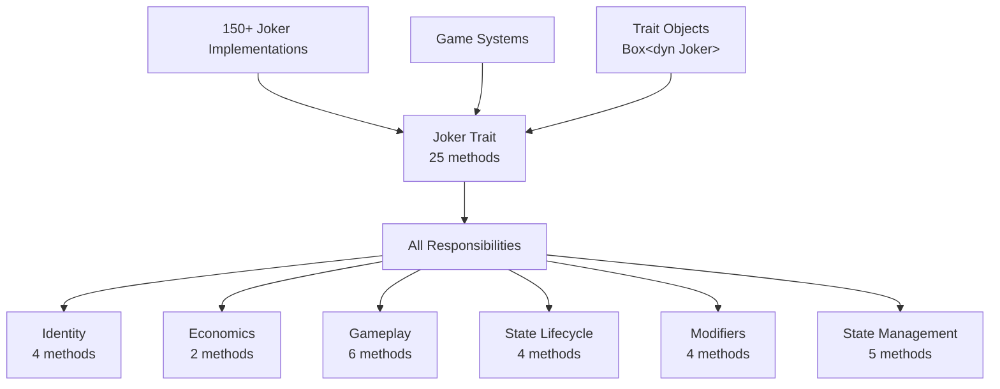
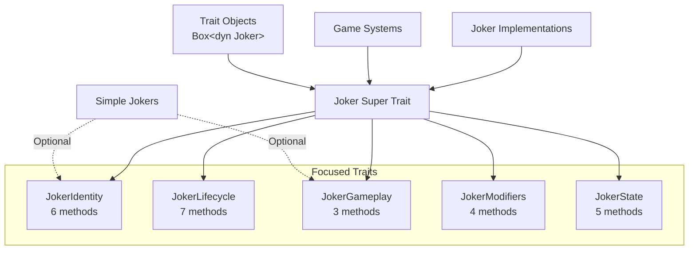
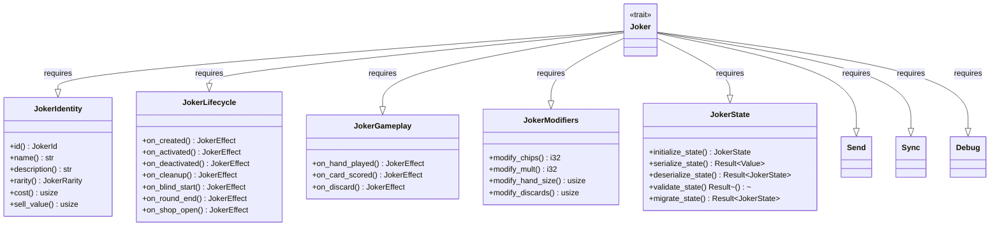
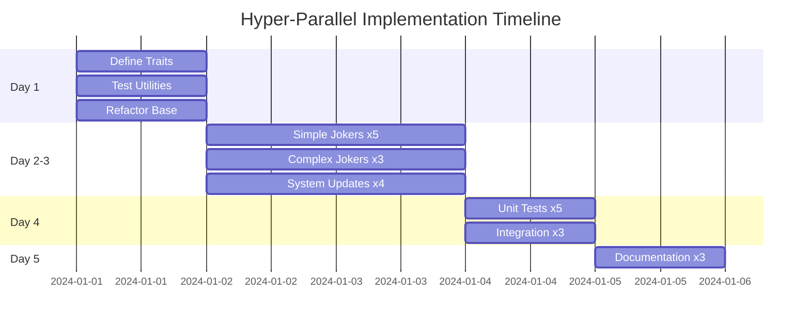

# Joker Trait Refactoring Technical Specification

## Executive Summary

The Joker trait has grown to 25 methods, violating the Interface Segregation Principle. This specification outlines a systematic refactoring to split it into 5 focused traits while maintaining backward compatibility. The refactoring will improve code maintainability, enable better testing, and make it easier to implement new joker types.

### Problem Statement
- Single trait with 25 methods handling multiple responsibilities
- Forces all 150+ joker implementations to provide methods they don't use
- Difficult to test individual aspects in isolation
- High cognitive load for developers implementing new jokers

### Proposed Solution
- Split into 5 focused traits: Identity, Lifecycle, Gameplay, Modifiers, and State
- Create a super trait for backward compatibility
- Enable granular trait implementation
- Improve testing infrastructure with trait-specific utilities

### Key Benefits
- Better separation of concerns following SOLID principles
- Easier testing with focused mock implementations
- Reduced boilerplate for simple jokers
- Clearer intent and documentation
- Maintains full backward compatibility

## Requirements Analysis

### Functional Requirements
1. **Maintain all existing functionality** - No joker behavior should change
2. **Support trait objects** - Continue using `Box<dyn Joker>` throughout
3. **Enable partial implementation** - Jokers can implement only needed traits
4. **Preserve thread safety** - Keep Send + Sync requirements
5. **Support serialization** - Maintain save/load compatibility

### Non-Functional Requirements
1. **Performance**: No runtime overhead from trait splitting
2. **Compatibility**: All existing code must compile without changes
3. **Testability**: Each trait aspect testable in isolation
4. **Maintainability**: Clear trait boundaries and responsibilities
5. **Extensibility**: Easy to add new trait methods in appropriate places

### Technical Constraints
1. **Heavy trait object usage** - Must work with dynamic dispatch
2. **150+ existing implementations** - Migration must be smooth
3. **Python bindings** - PyO3 integration must continue working
4. **Thread safety** - Required for RL training

## Architecture Overview

### Current Architecture (Monolithic)



### Target Architecture (Modular)



### Trait Hierarchy



## Detailed Trait Definitions

### 1. JokerIdentity Trait
```rust
/// Core identity and metadata for a joker
pub trait JokerIdentity: Send + Sync {
    /// Unique identifier for this joker type
    fn id(&self) -> JokerId;
    
    /// Display name for the joker
    fn name(&self) -> &str;
    
    /// Description of the joker's effect
    fn description(&self) -> &str;
    
    /// Rarity level of the joker
    fn rarity(&self) -> JokerRarity;
    
    /// Base cost in the shop (can be overridden)
    fn cost(&self) -> usize {
        match self.rarity() {
            JokerRarity::Common => 3,
            JokerRarity::Uncommon => 6,
            JokerRarity::Rare => 8,
            JokerRarity::Legendary => 50,
        }
    }
    
    /// Sell value calculation
    fn sell_value(&self, accumulated_bonus: f64) -> usize {
        (self.cost() as f64 / 2.0 + accumulated_bonus).round() as usize
    }
}
```

### 2. JokerLifecycle Trait
```rust
/// Lifecycle hooks for joker state transitions
pub trait JokerLifecycle {
    /// Called when the joker is first created
    fn on_created(&self, _context: &mut GameContext) -> JokerEffect {
        JokerEffect::new()
    }
    
    /// Called when the joker becomes active
    fn on_activated(&self, _context: &mut GameContext) -> JokerEffect {
        JokerEffect::new()
    }
    
    /// Called when the joker is deactivated
    fn on_deactivated(&self, _context: &mut GameContext) -> JokerEffect {
        JokerEffect::new()
    }
    
    /// Called when the joker is being removed
    fn on_cleanup(&self, _context: &mut GameContext) -> JokerEffect {
        JokerEffect::new()
    }
    
    /// Called at the start of each blind
    fn on_blind_start(&self, _context: &mut GameContext) -> JokerEffect {
        JokerEffect::new()
    }
    
    /// Called at the end of each round
    fn on_round_end(&self, _context: &mut GameContext) -> JokerEffect {
        JokerEffect::new()
    }
    
    /// Called when the shop opens
    fn on_shop_open(&self, _context: &mut GameContext) -> JokerEffect {
        JokerEffect::new()
    }
}
```

### 3. JokerGameplay Trait
```rust
/// Core gameplay hooks for joker effects
pub trait JokerGameplay {
    /// Called when a hand is played
    fn on_hand_played(&self, _context: &mut GameContext, _hand: &SelectHand) -> JokerEffect {
        JokerEffect::new()
    }
    
    /// Called for each card scored (performance critical)
    fn on_card_scored(&self, _context: &mut GameContext, _card: &Card) -> JokerEffect {
        JokerEffect::new()
    }
    
    /// Called when cards are discarded
    fn on_discard(&self, _context: &mut GameContext, _cards: &[Card]) -> JokerEffect {
        JokerEffect::new()
    }
}
```

### 4. JokerModifiers Trait
```rust
/// Permanent game rule modifications
pub trait JokerModifiers {
    /// Modify base chip value
    fn modify_chips(&self, _context: &GameContext, base_chips: i32) -> i32 {
        base_chips
    }
    
    /// Modify base mult value
    fn modify_mult(&self, _context: &GameContext, base_mult: i32) -> i32 {
        base_mult
    }
    
    /// Modify hand size limit
    fn modify_hand_size(&self, _context: &GameContext, base_size: usize) -> usize {
        base_size
    }
    
    /// Modify discard limit
    fn modify_discards(&self, _context: &GameContext, base_discards: usize) -> usize {
        base_discards
    }
}
```

### 5. JokerState Trait
```rust
/// State management and persistence
pub trait JokerState {
    /// Initialize default state for this joker
    fn initialize_state(&self, _context: &GameContext) -> crate::JokerState {
        crate::JokerState::default()
    }
    
    /// Serialize joker state to JSON
    fn serialize_state(
        &self, 
        _context: &GameContext, 
        state: &crate::JokerState
    ) -> Result<Value, serde_json::Error> {
        serde_json::to_value(state)
    }
    
    /// Deserialize joker state from JSON
    fn deserialize_state(
        &self, 
        _context: &GameContext, 
        data: &Value
    ) -> Result<crate::JokerState, serde_json::Error> {
        serde_json::from_value(data.clone())
    }
    
    /// Validate state consistency
    fn validate_state(
        &self, 
        _context: &GameContext, 
        _state: &crate::JokerState
    ) -> Result<(), String> {
        Ok(())
    }
    
    /// Migrate state from older versions
    fn migrate_state(
        &self, 
        _context: &GameContext, 
        old_state: &Value, 
        _from_version: u32
    ) -> Result<crate::JokerState, String> {
        self.deserialize_state(_context, old_state)
            .map_err(|e| e.to_string())
    }
}
```

### 6. Joker Super Trait
```rust
/// Complete joker interface combining all aspects
/// Maintains backward compatibility with existing code
pub trait Joker: 
    JokerIdentity + 
    JokerLifecycle + 
    JokerGameplay + 
    JokerModifiers + 
    JokerState + 
    Send + 
    Sync + 
    std::fmt::Debug 
{
    // Can add convenience methods here if needed
}
```

## Implementation Plan

### Phase 1: Create New Trait Structure (Foundation)

#### PR #1: Define new traits
**Goal**: Introduce new trait definitions without breaking existing code
**Size**: ~300 lines

1. Create `joker/traits.rs` module with all new trait definitions
2. Export traits from `joker/mod.rs` alongside existing trait
3. No changes to existing Joker trait yet
4. Add comprehensive documentation

#### PR #2: Create test utilities
**Goal**: Build testing infrastructure for new traits
**Size**: ~400 lines

1. Create `joker/test_utils.rs` module
2. Implement mock jokers for each trait
3. Add test context builders
4. Create assertion helpers
5. Write unit tests for utilities

### Phase 2: Implement Trait Splitting (Parallel Work)

#### PR #3: Refactor Joker trait to use new traits
**Goal**: Make existing Joker trait a super trait
**Size**: ~200 lines
**Dependencies**: PR #1

1. Move methods from Joker trait to appropriate sub-traits
2. Make Joker require all sub-traits
3. Add blanket implementation for backward compatibility
4. Ensure all existing code compiles

#### PR #4: Update simple jokers (batch 1)
**Goal**: Migrate first batch of simple jokers
**Size**: ~500 lines
**Dependencies**: PR #3
**Can be done by**: Developer A

Jokers to update:
- TheJoker, GreedyJoker, LustyJoker, WrathfulJoker
- GluttonousJoker, JollyJoker, ZanyJoker, MadJoker

#### PR #5: Update simple jokers (batch 2)
**Goal**: Migrate second batch of simple jokers
**Size**: ~500 lines
**Dependencies**: PR #3
**Can be done by**: Developer B

Jokers to update:
- CrazyJoker, DrollJoker, SlyJoker, WilyJoker
- CleverJoker, DeviousJoker, CraftyJoker, BannerJoker

#### PR #6: Update complex jokers
**Goal**: Migrate state-based and complex jokers
**Size**: ~400 lines
**Dependencies**: PR #3
**Can be done by**: Developer C

Jokers to update:
- IceCreamJoker, RunnerJoker, SpaceJoker, SupernovaJoker
- BullJoker, StoneJoker, ScaryFaceJoker, BlueJoker, DnaJoker

### Phase 3: System Integration (Sequential)

#### PR #7: Update JokerEffectProcessor
**Goal**: Optimize processor to use specific traits
**Size**: ~200 lines
**Dependencies**: PR #3-6

1. Update to use JokerGameplay trait where appropriate
2. Add specialized processing paths
3. Maintain backward compatibility
4. Add performance benchmarks

#### PR #8: Update JokerStateManager
**Goal**: Use JokerState trait directly
**Size**: ~150 lines
**Dependencies**: PR #3-6

1. Update to use JokerState trait methods
2. Improve type safety
3. Add migration tests

#### PR #9: Update factory and registry
**Goal**: Ensure factories work with new trait system
**Size**: ~100 lines
**Dependencies**: PR #3-6

1. Update JokerFactory trait bounds
2. Verify all joker creation paths
3. Update registry if needed

### Phase 4: Testing and Documentation

#### PR #10: Comprehensive testing
**Goal**: Add trait-specific tests
**Size**: ~600 lines
**Dependencies**: All previous PRs

1. Unit tests for each trait
2. Integration tests for trait composition
3. Property-based tests for contracts
4. Performance benchmarks

#### PR #11: Documentation and examples
**Goal**: Update all documentation
**Size**: ~300 lines
**Dependencies**: All previous PRs

1. Update trait documentation
2. Add implementation guide
3. Create example jokers using minimal traits
4. Update CLAUDE.md with new patterns

## Migration Guide

### For Simple Jokers (Most Common)

**Before:**
```rust
impl Joker for TheJoker {
    fn id(&self) -> JokerId { JokerId::Joker }
    fn name(&self) -> &str { "Joker" }
    fn description(&self) -> &str { "+4 Mult" }
    fn rarity(&self) -> JokerRarity { JokerRarity::Common }
    
    fn on_hand_played(&self, _context: &mut GameContext, _hand: &SelectHand) -> JokerEffect {
        JokerEffect::new().with_mult(4)
    }
}
```

**After (Option 1 - Implement all traits):**
```rust
impl JokerIdentity for TheJoker {
    fn id(&self) -> JokerId { JokerId::Joker }
    fn name(&self) -> &str { "Joker" }
    fn description(&self) -> &str { "+4 Mult" }
    fn rarity(&self) -> JokerRarity { JokerRarity::Common }
}

impl JokerGameplay for TheJoker {
    fn on_hand_played(&self, _context: &mut GameContext, _hand: &SelectHand) -> JokerEffect {
        JokerEffect::new().with_mult(4)
    }
}

// Implement other traits with defaults
impl JokerLifecycle for TheJoker {}
impl JokerModifiers for TheJoker {}
impl JokerState for TheJoker {}

// Still implements full Joker trait
impl Joker for TheJoker {}
```

**Note**: The Joker super trait will be maintained permanently as the primary interface, providing both backward compatibility and a convenient way to work with complete joker implementations.

### For Framework-Based Jokers

```rust
// StaticJoker can implement only needed traits
impl JokerIdentity for StaticJoker {
    // Required methods
}

impl JokerGameplay for StaticJoker {
    // Only implement methods used by this framework
}

// Other traits get default implementations
```

### For Test Jokers

```rust
// Can now create focused test doubles
struct TestScoringJoker {
    mult: i32,
}

impl JokerGameplay for TestScoringJoker {
    fn on_hand_played(&self, _: &mut GameContext, _: &SelectHand) -> JokerEffect {
        JokerEffect::new().with_mult(self.mult)
    }
}

// Only implement traits needed for the test
```

## Risk Assessment and Mitigation

### Technical Risks

#### Risk 1: Breaking Changes to Public API
**Probability**: Low
**Impact**: High
**Mitigation**:
- Keep Joker as super trait requiring all sub-traits
- Existing `Box<dyn Joker>` continues to work
- All existing implementations compile without changes
- Extensive testing of trait object usage

#### Risk 2: Performance Regression
**Probability**: Very Low
**Impact**: Medium
**Mitigation**:
- No additional indirection or allocations
- Trait methods remain inline-able
- Benchmark before and after each PR
- Profile hot paths (scoring)

#### Risk 3: Python Binding Compatibility
**Probability**: Low
**Impact**: Medium
**Mitigation**:
- Test PyO3 bindings with each change
- Ensure trait objects still work from Python
- Update Python tests as needed

#### Risk 4: Missing Trait Implementations
**Probability**: Medium
**Impact**: Low
**Mitigation**:
- Compiler will catch missing implementations
- Manual implementation guides
- Clear migration guide
- Phased rollout allows fixing issues early

### Implementation Risks

#### Risk 5: Developer Confusion
**Probability**: Medium
**Impact**: Low
**Mitigation**:
- Comprehensive documentation
- Clear examples
- Migration guide
- Code review emphasis on patterns

#### Risk 6: Test Coverage Gaps
**Probability**: Low
**Impact**: Medium
**Mitigation**:
- Dedicated test PR
- Trait-specific test utilities
- Coverage tracking
- Integration test suite

## Success Metrics

### Code Quality Metrics
- **Trait cohesion**: Each trait has single responsibility
- **Method count**: No trait has more than 7 methods
- **Implementation burden**: Simple jokers need only 2 trait impls
- **Test coverage**: >95% coverage of trait methods

### Performance Metrics
- **Benchmark regression**: <1% performance impact
- **Memory usage**: No increase
- **Compilation time**: Minimal increase (<5%)

### Development Metrics
- **PR size**: Average <400 lines changed
- **Review time**: <1 hour per PR
- **Migration time**: <5 minutes per joker
- **Completion time**: 3-4 weeks

### Acceptance Criteria
- [ ] All 11 PRs merged successfully
- [ ] All existing tests pass
- [ ] No performance regression >1%
- [ ] All 150+ jokers migrated
- [ ] Documentation complete
- [ ] Python bindings working

## Testing Strategy (Unit Test Focus)

### Comprehensive Unit Testing Per Trait

#### JokerIdentity Unit Tests
```rust
#[cfg(test)]
mod identity_tests {
    use super::*;
    
    #[test]
    fn test_id_uniqueness() {
        // Verify all joker IDs are unique
    }
    
    #[test]
    fn test_cost_matches_rarity() {
        // Verify cost calculation follows rarity rules
    }
    
    #[test]
    fn test_sell_value_calculation() {
        // Test sell value with various bonuses
    }
}
```

#### JokerGameplay Unit Tests
```rust
#[cfg(test)]
mod gameplay_tests {
    use super::*;
    
    #[test]
    fn test_effect_isolation() {
        // Test each gameplay method in isolation
    }
    
    #[test]
    fn test_effect_accumulation() {
        // Test that effects combine properly
    }
    
    #[test]
    fn test_context_mutations() {
        // Verify context changes are appropriate
    }
}
```

#### Per-Joker Unit Tests
```rust
#[cfg(test)]
mod the_joker_tests {
    use super::*;
    
    #[test]
    fn test_identity_contract() {
        let joker = TheJoker;
        assert_eq!(joker.id(), JokerId::Joker);
        assert_eq!(joker.name(), "Joker");
        assert_eq!(joker.rarity(), JokerRarity::Common);
        assert_eq!(joker.cost(), 3);
    }
    
    #[test]
    fn test_gameplay_effect() {
        let joker = TheJoker;
        let mut context = TestContextBuilder::new().build();
        let hand = create_test_hand();
        
        let effect = joker.on_hand_played(&mut context, &hand);
        assert_eq!(effect.mult, 4);
        assert_eq!(effect.chips, 0);
    }
    
    #[test]
    fn test_unused_traits_have_defaults() {
        let joker = TheJoker;
        // Verify all unused trait methods return defaults
        assert!(joker.on_blind_start(&mut context).is_empty());
        assert_eq!(joker.modify_chips(&context, 100), 100);
    }
}
```

### Test Coverage Requirements
- **Each trait**: Minimum 95% coverage
- **Each joker**: At least 3 unit tests
- **Edge cases**: Comprehensive boundary testing
- **Performance**: Sub-millisecond test execution

## Sprint Breakdown

### Hyper-Parallel Sprint Plan (1 Week Total)
**Goal**: Complete entire refactoring in 1 week with massive parallelization
**Velocity**: 11 PRs in 5 days

#### Day 1: Foundation Blitz (3 Parallel PRs)
1. **PR #1: Define New Traits** - Dev 1
   - Create trait definitions
   - Add documentation
   - Set up module structure
   
2. **PR #2: Test Utilities** - Dev 2
   - Mock implementations for unit testing
   - Test builders
   - Assertion helpers
   
3. **PR #3: Refactor Base Trait** - Dev 3
   - Convert to super trait
   - Maintain compatibility
   - Add unit tests

#### Day 2-3: Mass Migration (15+ Parallel PRs)
**After PR #3 merges, split all 150+ jokers across developers:**

4. **PR #4-8: Simple Jokers** (5 PRs, 30 jokers each) - Devs 4-8
   - Each PR handles ~30 jokers
   - Include unit tests for each trait implementation
   
5. **PR #9-11: Complex/State Jokers** (3 PRs) - Devs 9-11
   - State-based jokers (IceCreamJoker, etc.)
   - Framework jokers (StaticJoker, ConditionalJoker)
   - Comprehensive unit tests

6. **PR #12-15: System Updates** (4 Parallel PRs) - Devs 12-15
   - PR #12: JokerEffectProcessor optimization
   - PR #13: JokerStateManager updates  
   - PR #14: Factory and Registry updates
   - PR #15: Shop system updates

#### Day 4: Testing Blitz (5+ Parallel PRs)
7. **PR #16-20: Comprehensive Unit Tests** - Devs 16-20
   - PR #16: JokerIdentity trait unit tests
   - PR #17: JokerLifecycle trait unit tests
   - PR #18: JokerGameplay trait unit tests
   - PR #19: JokerModifiers trait unit tests
   - PR #20: JokerState trait unit tests

8. **PR #21-23: Integration & Performance** - Devs 21-23
   - PR #21: Integration test suite
   - PR #22: Performance benchmarks
   - PR #23: Python binding tests

#### Day 5: Polish & Documentation
9. **PR #24-26: Final Updates** - Devs 24-26
   - PR #24: Documentation updates
   - PR #25: Example implementations
   - PR #26: CLAUDE.md updates

### Parallelization Strategy



### Developer Allocation
- **Day 1**: 3 developers on foundation
- **Day 2-3**: 15 developers on parallel implementation
- **Day 4**: 8 developers on testing
- **Day 5**: 3 developers on documentation
- **Total**: 26 developers working in parallel at peak

## Example Implementations

### Minimal Joker (Only Identity + Gameplay)
```rust
#[derive(Debug, Clone)]
struct MinimalJoker;

impl JokerIdentity for MinimalJoker {
    fn id(&self) -> JokerId { JokerId::Custom("minimal".to_string()) }
    fn name(&self) -> &str { "Minimal Joker" }
    fn description(&self) -> &str { "Adds 10 chips" }
    fn rarity(&self) -> JokerRarity { JokerRarity::Common }
}

impl JokerGameplay for MinimalJoker {
    fn on_hand_played(&self, _: &mut GameContext, _: &SelectHand) -> JokerEffect {
        JokerEffect::new().with_chips(10)
    }
}

// Default implementations for other traits
impl JokerLifecycle for MinimalJoker {}
impl JokerModifiers for MinimalJoker {}
impl JokerState for MinimalJoker {}

impl Joker for MinimalJoker {}
```

### State-Based Joker
```rust
#[derive(Debug, Clone)]
struct CounterJoker;

impl JokerIdentity for CounterJoker {
    fn id(&self) -> JokerId { JokerId::Custom("counter".to_string()) }
    fn name(&self) -> &str { "Counter" }
    fn description(&self) -> &str { "Gains +1 Mult per hand played" }
    fn rarity(&self) -> JokerRarity { JokerRarity::Uncommon }
}

impl JokerState for CounterJoker {
    fn initialize_state(&self, _: &GameContext) -> crate::JokerState {
        let mut state = crate::JokerState::default();
        state.insert("count".to_string(), 0.into());
        state
    }
}

impl JokerGameplay for CounterJoker {
    fn on_hand_played(&self, context: &mut GameContext, _: &SelectHand) -> JokerEffect {
        let count = context.joker_state_manager
            .get_state_mut(self.id())
            .and_then(|s| s.get_mut("count"))
            .and_then(|v| v.as_u64_mut())
            .unwrap_or(&mut 0);
        
        *count += 1;
        JokerEffect::new().with_mult(*count as i32)
    }
}

// Default implementations
impl JokerLifecycle for CounterJoker {}
impl JokerModifiers for CounterJoker {}

impl Joker for CounterJoker {}
```

## Conclusion

This refactoring transforms the monolithic 25-method Joker trait into 5 focused traits, each with a single responsibility. The design maintains full backward compatibility through the permanent Joker super trait while enabling:

1. **Better separation of concerns** - Each trait handles one aspect
2. **Superior unit testing** - Test each trait in complete isolation
3. **Reduced implementation burden** - Implement only what you need
4. **Improved maintainability** - Clear boundaries and responsibilities
5. **Enhanced extensibility** - Easy to add new trait methods in the right place

With infinite developer resources, the hyper-parallel implementation can complete in just 1 week:
- **Day 1**: Foundation (3 PRs)
- **Day 2-3**: Mass migration (15+ PRs)
- **Day 4**: Testing blitz (8+ PRs)
- **Day 5**: Documentation (3 PRs)

The focus on comprehensive unit testing ensures each trait implementation is thoroughly validated, while independent revertibility of each PR minimizes risk. This aggressive timeline delivers architectural improvements at maximum velocity while maintaining code quality and system stability.